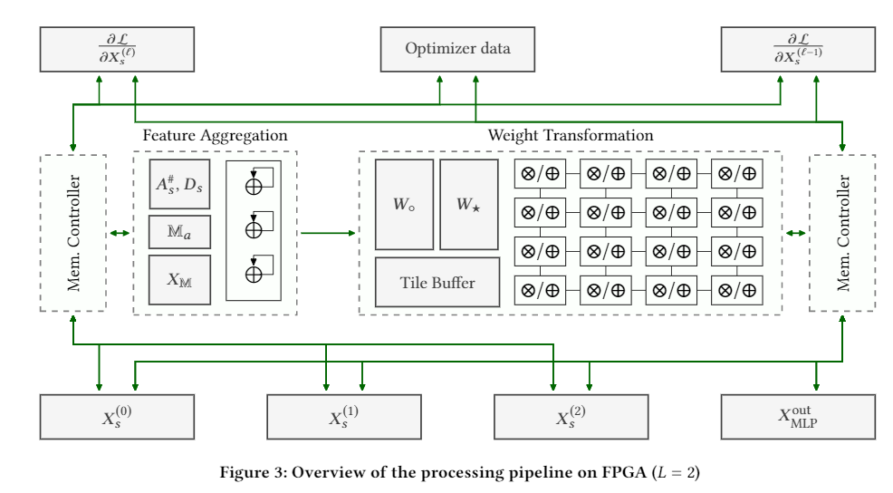

## GraphACT: Accelerating GCN Training on CPU-FPGA Heterogeneous Platform [[PDF](https://arxiv.org/abs/2001.02498)]
---
### Abstract 
Graph Convolutional Networks (GCNs) have emerged as the state-of-the-art deep learning model for representation learning on graphs. It is challenging to accelerate training of GCNs, due to (1) substantial and irregular data communication to propagate information within the graph, and (2) intensive computation to propagate information along the neural network layers. To address these challenges, we design a novel accelerator for training GCNs on CPU-FPGA heterogeneous systems, by incorporating multiple algorithm-architecture co-optimizations. We first analyze the computation and communication characteristics of various GCN training algorithms, and select a subgraph-based algorithm that is well suited for hardware execution. To optimize the feature propagation within subgraphs, we propose a light-weight pre-processing step based on a graph theoretic approach. Such pre-processing performed on the CPU significantly reduces the memory access requirements and the computation to be performed on the FPGA.  To accelerate the weight update in GCN layers, we propose a systolic array based design for efficient parallelization. We integrate the above optimizations into a complete hardware pipeline, and analyze its load-balance and resource utilization by accurate performance modeling. We evaluate our design on Intel Stratix 10 board hosted by a 40-core Xeon server. On three large graphs, we achieve an order of magnitude training speedup with negligible accuracy loss, compared with state-of-the-art implementation on a multi-core platform. 

### Implementation details
- FPGA platform: **Intel Stratix 10 1SX280LH3F55I3XG**
  - Tool: **Quartus prime pro 20.1** for synthesis
- CPU platform: 40-core Xeon server (E5-2698 v4 @2.2GHz, hyper-threaded)

### hardware architecture

### Directory Structure
- /hardware: contains the verilog code of the design
  - system.v: main module
  - Aggregation.v: feature aggregation module
  - reluArray.v: activation module
  - transformationPlusActivation.v: transformation models and activation models
  - Data buffer:
    - columnbuffer.v
    - indiceDoubleBuffer.v
    - indptrDoubleBuffer.v
    - weightBuffer.v
    - rowbuffer.v
- /perf_model: performance modeling using python script

### Configuring IP Cores
- floating point Accumulator--sysAcc
  - Find: IP catalog => basic function => arithmetic => floating point function
  - Name: Accumulator
  - Other Info: choose Generate Enable and generate HDL
- floating point multiplier--mul
  - Find: IP catalog => basic function => arithmetic => floating point function
  - Name: Multiply
  - Other Info: In Functionality choose Generate Enable and generate HDL
- floating point comparator 
  - Find: IP catalog => basic function => arithmetic => functionality => Comparison 
  - Name: Greater than
  - Other Info: In Functionality choose Generate Enable and generate HDL
- RAM 1 port--Weight buffer 
  - Find: IP catalog => on-chip memory => RAM: 1-port intel FPGA IP
  - Name: weightbuffer 
  - Other Info: choose Generate Enable and generate HDL
- RAM 2 port--row buffer 
  - Find: IP catalog => on-chip memory => RAM: 2-port intel FPGA IP
  - Name: row buffer  
  - Other Info: choose Generate Enable and generate HDL
- RAM 2 port--column buffer 
  - Find: IP catalog => on-chip memory => RAM: 2-port intel FPGA IP
  - Name: column buffer  
  - Other Info: choose Generate Enable and generate HDL
- RAM 2 port--indptr buffer 
  - Find: IP catalog => on-chip memory => RAM: 2-port intel FPGA IP
  - Name: indptr buffer  
  - Other Info: choose Generate Enable and generate HDL
- RAM 2 port--indptr buffer 
  - Find: IP catalog => on-chip memory => RAM: 2-port intel FPGA IP
  - Name: indptr buffer  
  - Other Info: choose Generate Enable and generate HDL
- RAM 2 port--indice buffer 
  - Find: IP catalog => on-chip memory => RAM: 2-port intel FPGA IP
  - Name: indice buffer  
  - Other Info: choose Generate Enable and generate HDL
  
### Setting up the projects
1. Create a new project in Quartus Prime PRO 20.1 and set the **Intel Stratix 10 1SX280LH3F55I3XG** as the target device
2. Add all the .v files in /hardware directory to the project
3. Set the system.v as the top module
4. Start the compilation
